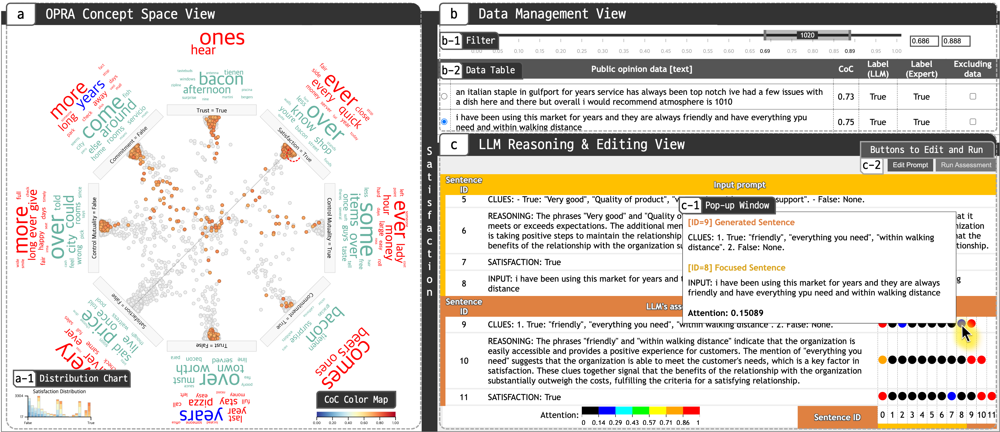
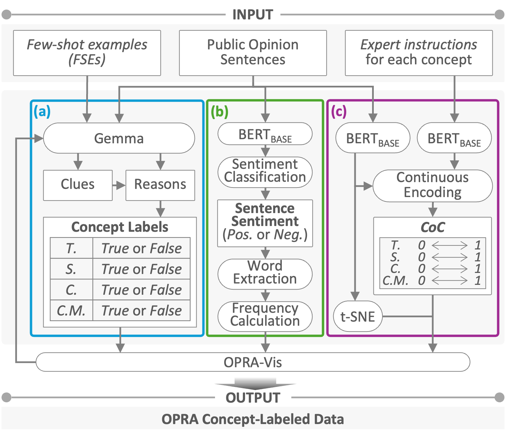
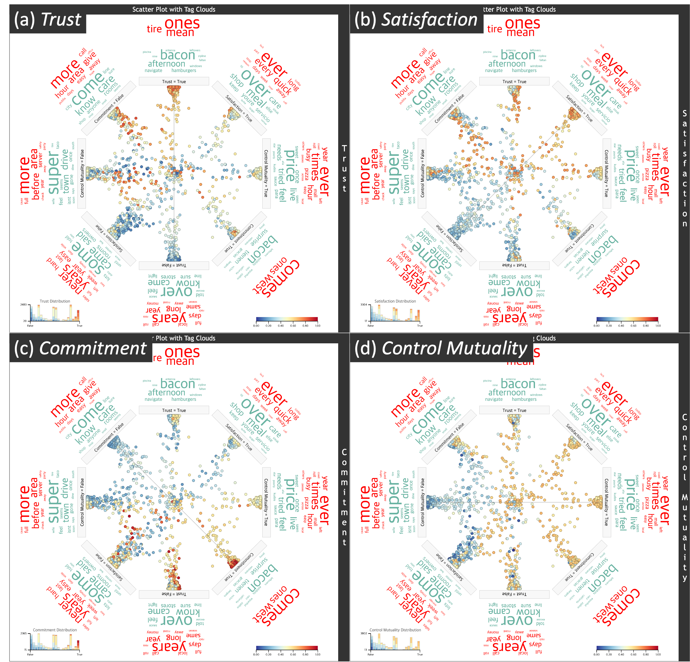
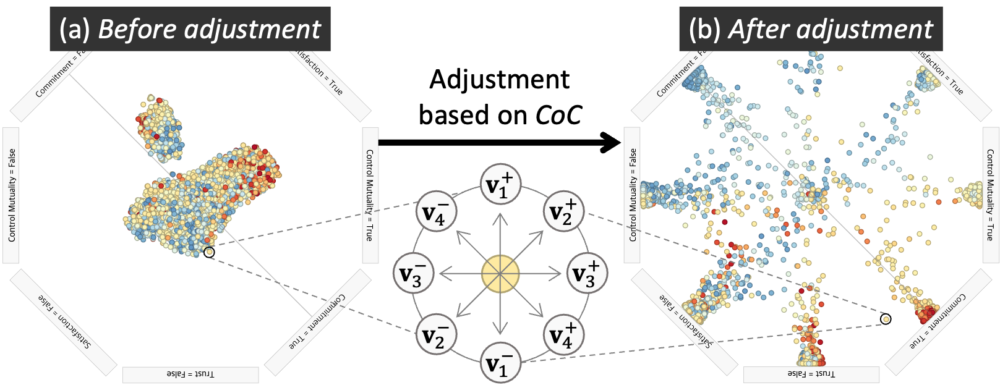

# OPRA-Vis: Visual Analytics System to Assist Organization-Public Relationship Assessment with Large Language Models

**Authors:** Sangbong Yoo*, Seongbum Seo*, Chanyoung Yoon, Hyelim Lee, Jeong-Nam Kim, Chansoo Kim, Yun Jang†, and Takanori Fujiwara  
(*Equal contribution, †Corresponding author)

This repository contains the source code and materials for **OPRA-Vis**, a visual analytics system that leverages Large Language Models (LLMs) for Organization-Public Relationship Assessment (OPRA) without requiring extensive labeled datasets.

## Abstract

<div align="center">
  
</div>

OPRA-Vis integrates LLM prompting with interactive visualizations to help PR experts analyze public opinion data. The system employs few-shot examples and expert-informed clues to guide LLM reasoning, while providing visualizations that reveal the assessment process for expert review and refinement.

## Demo Video

https://github.com/user-attachments/assets/1bd52af5-3b6c-4c67-8810-cf2e850d30a0

[▶ Watch on YouTube](https://youtu.be/oXUGtWGxAUw)

## System Architecture

<div align="center">
  
</div>

(a) **Concept Labeling**: Uses Gemma with Chain-of-Thought prompting for OPRA concept classification<br>
(b) **Sentiment Analysis**: Employs BERT for sentiment classification and word frequency analysis<br>
(c) **Certainty Computation**: Calculates Certainty of Concepts (CoC) for uncertainty quantification

## Interface Components

### OPRA Concept Space View

<div align="center">
  
</div>

The scatter plot features an octagonal layout that displays sentence positioning based on OPRA concepts (Trust, Satisfaction, Commitment, Control Mutuality). The visualization uses color-coded certainty levels with a blue-yellow-red scheme and includes tag clouds for sentiment-aware word analysis.

### Position Adjustment using Gravity Model

<div align="center">
  
</div>

Physics-inspired gravity model that adjusts sentence positions based on Certainty of Concepts (CoC) values, creating intuitive spatial clustering.

## Usage

### Basic Usage

```bash
python app.py --data {dataname} --scale {scale} [--volume {volume}]
```

### Parameters

- `--data`: Dataset name - **Required**
  - `amazon`: Amazon product reviews
  - `local`: Google Local business reviews  
  - `imdb`: IMDB movie reviews
  - `jigsaw`: Jigsaw toxic comments dataset
- `--scale`: Measurement scale - **Required**
  - `opra`: Organization-Public Relationship Assessment (4 concepts)
  - `toxicity`: Toxicity classification (5 dimensions)
- `--volume`: Number of data samples to load - **Optional**

### Examples

```bash
# Run OPRA analysis on Amazon reviews
python app.py --data amazon --scale opra

# Run toxicity analysis on Jigsaw dataset
python app.py --data jigsaw --scale toxicity --volume 10000

# Run OPRA analysis on Google Local reviews
python app.py --data local --scale opra --volume 10000
```

## License

OPRA-Vis is released under the Apache-2.0 license. See the [LICENSE](LICENSE) file for more details.
